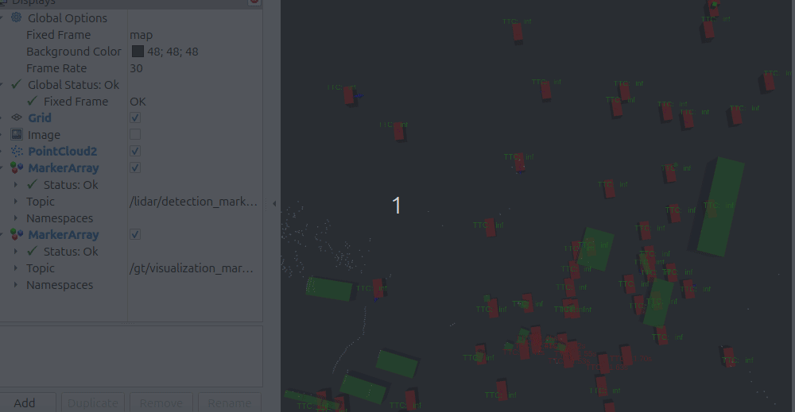

# ROS2 ADAS Perception and Tracking Stack

A modular **ROS2-based ADAS perception pipeline** built using the **nuScenes dataset**, implementing LiDAR-based object detection, multi-object tracking, velocity estimation, and Time-To-Collision (TTC) computation.

The project is designed as a **modular perception stack**, allowing easy replacement of detectors (ground truth, clustering, or learned models like PointPillars and CenterPoint).

---

## Demo

## System Overview

Pipeline:

nuScenes → Detector → Tracker → Velocity Estimation → TTC → Collision Risk

Modules implemented as ROS2 nodes.

---

## Features

• ROS2-based modular perception pipeline  
• LiDAR point cloud processing  
• Ground-truth and clustering-based object detection  
• Multi-object tracking using Kalman Filter  
• Hungarian algorithm for data association  
• Ego-relative velocity estimation  
• Time-To-Collision (TTC) computation  
• RViz visualization of tracked objects, velocities, and TTC  
• Detector modularity for PointPillars and CenterPoint integration  

---

## Architecture

Nodes in the system:

nuscenes_player
→ publishes camera images, LiDAR, GT detections, TF

lidar_cluster_detector
→ DBSCAN clustering on LiDAR point clouds

gt_tracker_node
→ multi-object tracking + velocity + TTC

lidar_detection_visualizer
→ RViz visualization

Detector modules (modular interface):

Ground Truth Detector
LiDAR Cluster Detector
PointPillars Detector (planned)
CenterPoint Detector (planned)

---

## Repository Structure

ros2-adas-perception-stack
│
├── src/av_fusion
│ ├── gt_tracker_node.py
│ ├── nuscenes_player.py
│ ├── lidar_cluster_detector.py
│ ├── lidar_detection_visualizer.py
│ ├── pointpillars_detector_node.py
│ └── centerpoint_detector_node.py
│
├── package.xml
├── setup.py
├── README.md
└── requirements.txt

---

## Dataset

This project uses the **nuScenes dataset**.

Download:

https://www.nuscenes.org/download

Recommended version for testing:

nuScenes-mini

Place the dataset in:

~/av_perception/data/nuscenes

---

## Installation

### 1. Clone repository

git clone https://github.com/GauravR2012/ros2-adas-perception-stack.git

### 2. Install dependencies

pip install -r requirements.txt

### 3. Build ROS2 workspace

colcon build

### 4. Source workspace

source install/setup.bash

---

## Running the Pipeline

### Start nuScenes player

ros2 run av_fusion nuscenes_player

### Start tracker

ros2 run av_fusion gt_tracker

### Start visualization

ros2 run av_fusion lidar_detection_visualizer

### Open RViz

rviz2

---

## Visualization

The system visualizes:

• LiDAR point clouds  
• Ground truth objects (green boxes)  
• Tracked objects (red boxes)  
• Velocity vectors (blue arrows)  
• Time-To-Collision labels  

---

## Future Work

Planned improvements:

• Sensor fusion (camera + LiDAR)  
• Collision risk classification  
• Motion prediction  
• Planning and control integration  

---

## Technologies Used

• ROS2  
• Python  
• nuScenes dataset  
• NumPy  
• SciPy  
• OpenCV  
• scikit-learn  
• RViz  

---

## Author

Gaurav Ramteke

Robotics / Autonomous Systems Enthusiast

